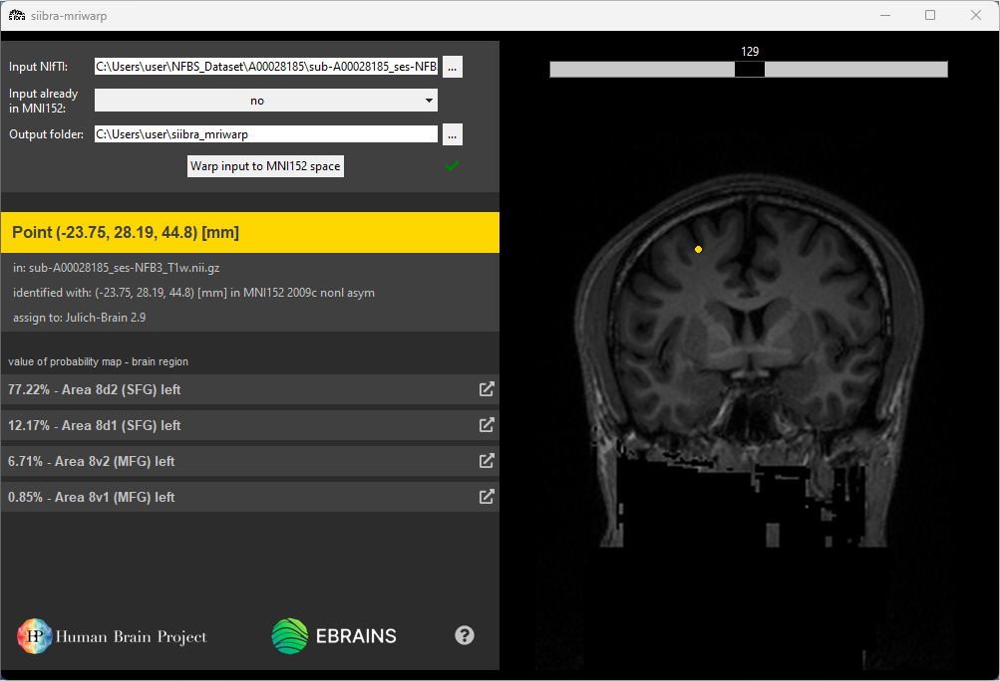

# voluba-mriwarp

> **Note: _voluba-mriwarp_ is still in development. You may still encounter bugs when using it.**

VoluBA (**Volu**metric **B**rain **A**nchoring) offers tools to connect volumetric imaging data to multilevel atlases and in this way makes it accessible for analysis with the siibra toolsuite.

_voluba-mriwarp_ is a desktop application that integrates whole brain T1-weighted MRI scans into the anatomical context of the [Julich Brain Atlas](https://julich-brain-atlas.de/). It incorporates all required components like skull stripping, registration to [ICBM MNI152 2009c nonlinear asymmetric space](https://www.bic.mni.mcgill.ca/ServicesAtlases/ICBM152NLin2009), and detailed analysis with the siibra toolsuite. The corresponding functionalities are provided via open-source tools like [HD-BET](https://github.com/MIC-DKFZ/HD-BET)[^1], [ANTs](http://stnava.github.io/ANTs/) and [siibra-python](https://github.com/FZJ-INM1-BDA/siibra-python). _voluba-mriwarp_ is primarily designed for Windows 10 but can also be executed on Linux.

Warping brain data to a standardized space like MNI152 enables anchoring of whole brain MRI scans to atlas volumes like [BigBrain](https://julich-brain-atlas.de/atlas/bigbrain). However, reasonable registration requires various steps that need optimization effort. _voluba-mriwarp_ aims to simplify this workflow. With this application, you avoid installing multiple tools and tweaking parameters for a proper registration result. Instead, _voluba-mriwarp_ is an easy-to-install and easy-to-use tool combining all necessary steps into one pipeline. 

> We designed _voluba-mriwarp_ as a desktop application. Therefore, **the input MRI dataset will not be uploaded to any online services**. It remains only on your local computer.

_voluba-mriwarp_ applies a set of predefined parameters to remove the skull and warp the input brain scan to MNI152 space. You can utilize the warping results in _voluba-mriwarp_ to interactively assign brain regions to a point in the input space. Select a location in the displayed brain of a subject to perform a probabilistic assignment using Julich-Brain Cytoarchitectonic Maps 2.9. Hence, you can estimate the probability of a brain region occurring at the selected point. To explore even more information about a cytoarchitectonic area, you can access [siibra-explorer](https://atlases.ebrains.eu/viewer/human) through the application.

## Getting Started

_voluba-mriwarp_ is designed as a Windows application but can also be executed on Linux.

### Windows 10 or higher

#### Install voluba-mriwarp

1. Download the installer [here](https://fz-juelich.sciebo.de/s/xbjgb8yx7Jw01Jq/download).
2. Run the installer.
3. Run _voluba-mriwarp_ directly from the installer. Depending on the installation settings you have chosen, you can also run _voluba-mriwarp_ from the installation directory, the start menu or the desktop shortcut.

#### Uninstall voluba-mriwarp

Run `Uninstall` from the installation directory or the `voluba-mriwarp` folder in your start menu, depending on the installation settings that you chose. If you wish to delete the default output folder, delete `voluba-mriwarp` from your home directory. Note that this may remove warping results.

Hint: The default installation directory is `C:\Users\your_username\AppData\Local\voluba-mriwarp`.

### Linux

#### Requirements

* Python 3.8 or higher
* [ANTs](https://github.com/ANTsX/ANTs/wiki/Compiling-ANTs-on-Linux-and-Mac-OS)

#### Install voluba-mriwarp

1. Install all requirements.
2. Clone _voluba-mriwarp_ from GitHub:

        git clone https://github.com/FZJ-INM1-BDA/voluba-mriwarp.git

3. Install all Python requirements with pip:

        cd voluba-mriwarp
        pip install scikit-build
        pip install -r requirements.txt

5. Run _voluba-mriwarp_:

        python3 start_app.py
        
> **Warning: If you run _voluba-mriwarp_ via Python on Windows, you need to change all `"/"` in `HD_BET.utils.maybe_mkdir_p` to `"\\"`.**

#### Uninstall voluba-mriwarp

Delete `voluba-mriwarp` from the installation directory. If you wish to delete the default output folder, delete `voluba-mriwarp` from your home directory. Note that this may remove warping results.

## Usage and Help

Visit [voluba-mriwarp.readthedocs.io](https://voluba-mriwarp.readthedocs.io) or contact [support@ebrains.eu](mailto:support@ebrains.eu?subject=[voluba-mriwarp]).

## Authors

[Big Data Analytics Group](https://fz-juelich.de/en/inm/inm-1/research/big-data-analytics), Institute of Neuroscience and Medicine (INM-1), Forschungszentrum Jülich GmbH

## License

This project is licensed under the Apache License 2.0 - see the LICENSE file for details

## References

* [HD-BET](https://github.com/MIC-DKFZ/HD-BET)[^1] (skull removal)
* [ANTs](http://stnava.github.io/ANTs/) (warping)
* [siibra-python](https://github.com/FZJ-INM1-BDA/siibra-python) (region assignment)

[^1]: Isensee F, Schell M, Tursunova I, Brugnara G, Bonekamp D, Neuberger U, Wick A, Schlemmer HP, Heiland S, Wick W, Bendszus M, Maier-Hein KH, Kickingereder P. Automated brain extraction of multi-sequence MRI using artificial neural networks. Hum Brain Mapp. 2019; 1–13. [https://doi.org/10.1002/hbm.24750](https://doi.org/10.1002/hbm.24750)

## Acknowledgments

This software code is funded from the European Union’s Horizon 2020 Framework Programme for Research and Innovation under the Specific Grant Agreement No. 945539 (Human Brain Project SGA3).

