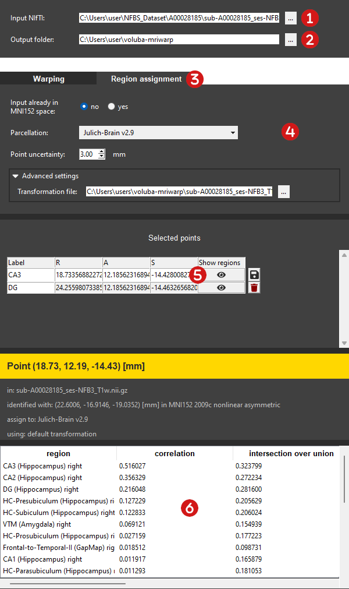
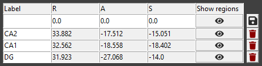
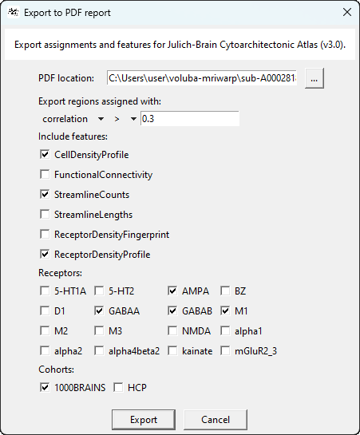

# Analysis in atlas context

_voluba-mriwarp_ allows you to perform detailed analysis of the input scan in the anatomical context of the [EBRAINS Human Brain Atlas](https://www.ebrains.eu/tools/human-brain-atlas) through the siibra toolsuite. The core functionality for the analysis is the probabilistic assignment of exact or imprecise coordinates in the input space to brain regions of the atlas. For this, siibra determines probability values from statistical parcellation maps. For extended analysis, the anatomical assignments can be [exported to a PDF report](#pdf-export) together with linked data features (e.g. cell density, receptor density or connectivity) for each assigned region.

To analyze the input MRI scan in the atlas context with probabilistic region assignment follow these steps:

 **Select the input MRI scan to inspect.**  
The <mark>Input NIfTI</mark> has to be a whole-brain T1-weighted MRI scan in NIfTI format (.nii or .nii.gz). You can either manually type in the path to the file or you can choose the input MRI scan in the file explorer by clicking <mark>...</mark>.

 **Choose the output folder containing the warping results.**  
Probabilistic region assignment can only be performed if a transformation from the input to MNI152 space exists. Per default, _voluba-mriwarp_ will search the matching transformation matrix `<filename>_transformationInverseComposite.h5` in the given <mark>Output folder</mark>. Please change the location to the folder where the warping results for the given <mark>Input NIfTI</mark> were written to or enter a specific transformation file in the [Advanced settings](#advanced-settings). If there are no results to this MRI scan yet, you need to [perform registration](../warping) first.

!!! hint
    The default output directory is `<path_to_your_home>\voluba-mriwarp`.

 **Switch to the <mark>Analysis</mark> menu section.**

 **Adjust the general settings, if needed.**  
The [General settings](#general-settings) allow you to adjust the details of the probabilistic assignment like the parcellation or point uncertainty.

 **Select a point in subject's space to analyze it**.  
There are two ways to choose points. In the [interactive viewer](viewer.md) you can select a point by double clicking a location in the input scan. Secondly, you can manually type in a coordinate in the first row of the <mark>Points</mark> table. _voluba-mriwarp_ will then assign brain regions to this point and display the results in the side panel. For more information about the tables, see the section on [Point selection](#point-selection) and [Results of the analysis](#results-of-the-analysis).

 **Get a quick overview about a specific region in siibra-explorer.**  
Double click a row in the assignment table to quickly view more information about the brain region in [siibra-explorer](https://atlases.ebrains.eu/viewer/human). Interactively explore brain connectivity and multimodal data features like transmitter receptor densities, cell distributions, and physiological recordings linked to this area.

 **Export a PDF report.**  
To retain your analysis _voluba-mriwarp_ offers to create a PDF report of the anatomical assignments which can optionally be extended with linked data features (e.g. cell density, receptor density or connectivity) of your choice.

## General settings

### Input already in MNI152
Set this to `yes` if the <mark>input NIfTI</mark> already shows the subject's brain warped to MNI152 space. Thus, the image is already aligned to MNI152 space and _voluba-mriwarp_ doesn't need to apply a transformation anymore.

### Parcellation
You can choose between different parcellations that are available for MNI152 space in the EBRAINS Human Atlas. A parcellation subdivides the brain into regions following organizational principles like cytoarchitecture (Julich-Brain), fibre architecture (fibre bundles) or function (functional modes, DiFuMo).

### Point uncertainty
The specification of a location in the input MRI is usually not exact, but rather has several millimeters of uncertainty. If you specify an uncertainty for points, you will not only get the probability values of the parcellation maps. Instead, a 3D gaussian blob is correlated with the probability maps producing different measures that are presented to you in the resulting assignment.

## Advanced settings

In the advanced settings you can specify a particular transformation file that is used by _voluba-mriwarp_. It can be a file produced by _voluba-mriwarp_ using the [Advanced settings for warping](../warping/#advanced-settings) or a file from another application. Keep in mind, that the file format needs to be ANTs compatible (`.mat` for linear or `.hdf5/.h5` for nonlinear transformations).

## Point selection

All points shown in _voluba-mriwarp_ are given in RAS physical space. To select a location, you can either double-click the according position in the interactive viewer or manually type in the coordinates in the first row of the <mark>Points</mark> table.

The <Points> table holds the currently selected point as well as all points that were saved. You can inspect and reassign regions to these points again at any time. Furthermore, the export functionality will include all saved points in the PDF report. The currently selected point can be saved to the table by clicking the floppy disk icon. _voluba-mriwap_ will automatically generate a label for each saved point by counting. To give meaning to a point, you can specify and adjust its name in the <mark>Label</mark> column. A saved point can be removed from the table by clicking the trash icon. If you want to repeat the assignment for a point again, click the brain icon in the row of the according location.

## Results of the analysis

After selecting a point you can find a table presenting the results of the point analysis in the side panel of the <mark>Analysis</mark> tab. Depending on the specified [point uncertainty](#point-uncertainty) the result of the anatomical assignment includes different measures. If the uncertainty is greater than or equal to 3 mm, a 3D gaussian blob is correlated with the probability maps of the parcellation resulting in additional measures. The following table explains the output of the probabilistic region assignment with uncertainty measures marked by *:

| measure | explanation |
|-------|--------------|
| region    | region assigned to the given point |
| map value | probability value of the region in the parcellation map |
| correlation* | correlation coefficient |
| intersection over union* | intersection over union |
| map weighted mean* | mean of the blob weighted by the map values |
| map containedness* | containness score of the region wrt. the blob |
| input weighted mean* | mean of the map values weighted by the blob |
| input containedness* | containedness score of the blob wrt. the region |

Per default, values are sorted by correlation. To sort for a different measure click on the corresponding column header in the table.

### PDF export

_voluba-mriwarp_ offers to create a PDF report of anatomical assignments for all saved points. Optionally, data features linked to the assigned brain regions in the atlas can be added to the report for further analysis. To initialize the export, click the button next to <mark>Points</mark>.

You are then asked to specify the export location for the PDF which initially points to the directory of <mark>Output folder</mark>. Following this you can define a filter which restricts to regions that fulfill the given requirement. For example, for each point only regions assigned with correlation > 0.3 are included in the report by default. In the last section you can finally choose between different multimodal data features complementing your existing analysis. In case you are interested in receptor density, you will need to select specific receptors that will be investigated. For connectivity features an additional selection of a cohort is required. Clicking on <mark>Export</mark> initiates the export procedure.

