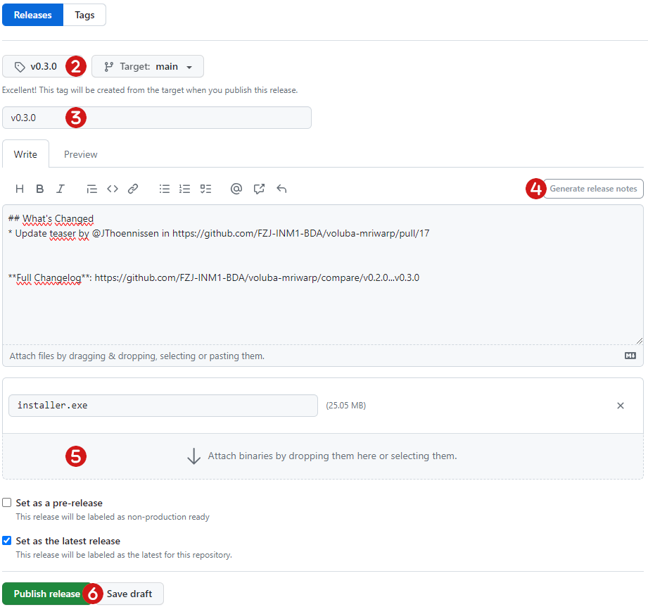

# Deployment instructions

Releases are tagged v[MAJOR].[MINOR].[PATCH] according to [Semantic Versioning](https://semver.org/) in git. After [building the release artifacts](build.md) from the master branch, deployment is done on [GitHub](#github-release) and [Zenodo](#zenodo-release).

## GitHub release

1. Create a [new release](https://github.com/FZJ-INM1-BDA/voluba-mriwarp/releases/new) on GitHub.  
2. Choose an existing tag or create a new one according to Semantic Versioning.
3. Set the version tag as Release title.
4. Click `Generate release notes` and combine them into a nice feature overview.
5. Upload the Windows installer as binary.
6. Publish the release.

## Zenodo release

Zenodo releases are automatically triggered by a GitHub release. All information displayed on Zenodo is specified in `.zenodo.json`. 
