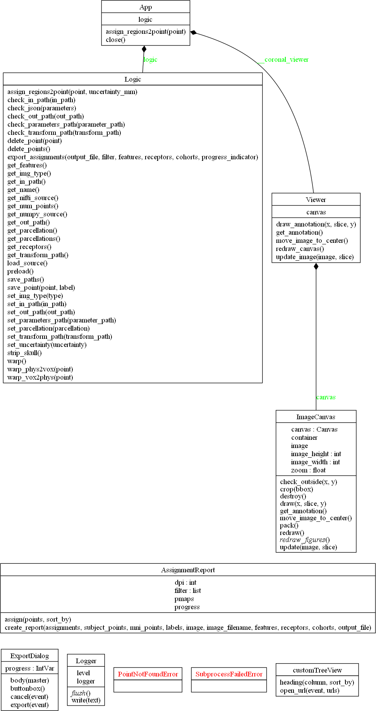
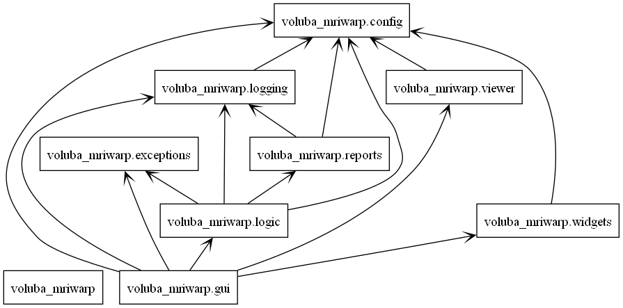

# Implementation details

All code is described with comments but some main concepts are described in the following sections.

## Dependencies

* GUI: [tkinter](https://docs.python.org/3/library/tkinter.html)
* Skull stripping: [HD-BET](https://github.com/MIC-DKFZ/HD-BET)[^1]
* Nonlinear registration: [ANTs](http://stnava.github.io/ANTs/)
* Region assignment: [siibra-python](https://siibra-python.readthedocs.io/en/latest/)

## Software architecture

The software is organized in Model View Controller (MVC). Here [class `Logic`](#class-logic) represents the Model and [class `App`](#class-app) represents the View. There is no specified Controller as there used to be minimal interaction between Model and View. Now that more functionalities have been added this should certainly be changed. 

------------------

### class `App`

**File**: `gui.py`

**Notes**: The `App` class represents the View and contains the creation of all tkinter widgets that form the GUI. Furthermore, the `App` processes events triggered by user interaction and initiates according actions in the Model.

------------------

### class `Viewer`

**File**: `viewer.py`

**Notes**: The `Viewer` class handles the visualization of the input NIfTI. It shows the data and allows the exploration of the data by moving and zooming into the image. It also manages displaying the selected point of a region assignment.

------------------

### class `Logic`

**File**: `logic.py`

**Notes**: The `Logic` class represents the Model and contains all data-related aspects. This class implements skull stripping, nonlinear registration and region assignments. 

------------------

### class `AssignmentReport`

**File**: `report.py`

**Notes**: The `AssignmentReport` class implements all functionality for exporting the results for the selected region assignments. All plots as well as the PDF are generated here.

------------------

## Class diagram

The following class diagram was automatically generated by [pyreverse](https://pylint.readthedocs.io/en/latest/pyreverse.html).

## Package diagram

The following package diagram was automatically generated by [pyreverse](https://pylint.readthedocs.io/en/latest/pyreverse.html).

---------------------------------

[^1]: Isensee F, Schell M, Tursunova I, Brugnara G, Bonekamp D, Neuberger U, Wick A, Schlemmer HP, Heiland S, Wick W, Bendszus M, Maier-Hein KH, Kickingereder P. Automated brain extraction of multi-sequence MRI using artificial neural networks. Hum Brain Mapp. 2019; 1–13. [https://doi.org/10.1002/hbm.24750](https://doi.org/10.1002/hbm.24750)
