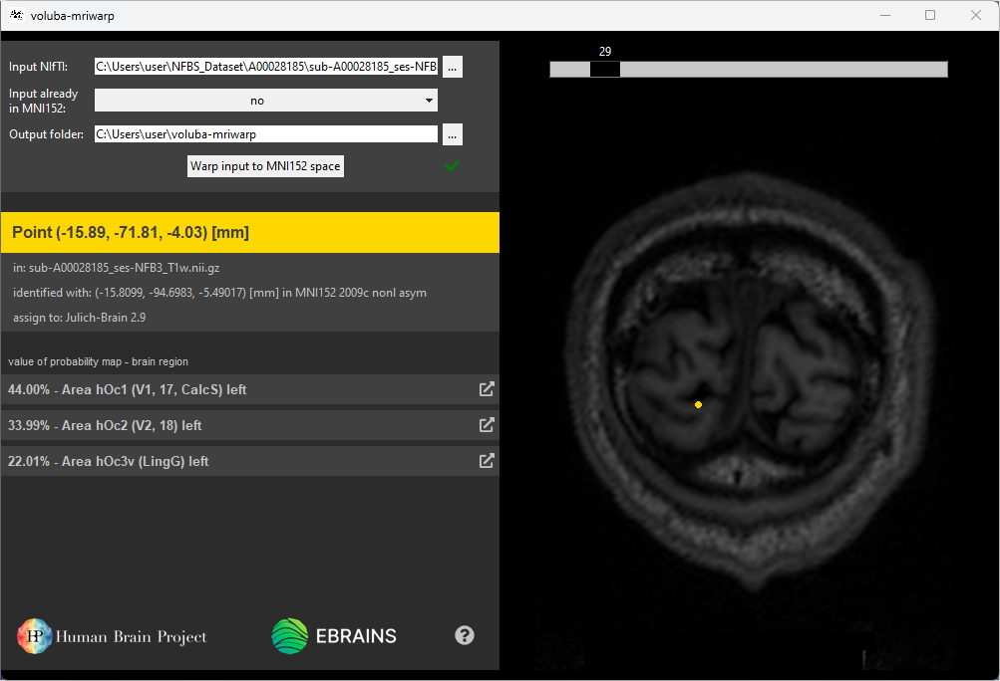
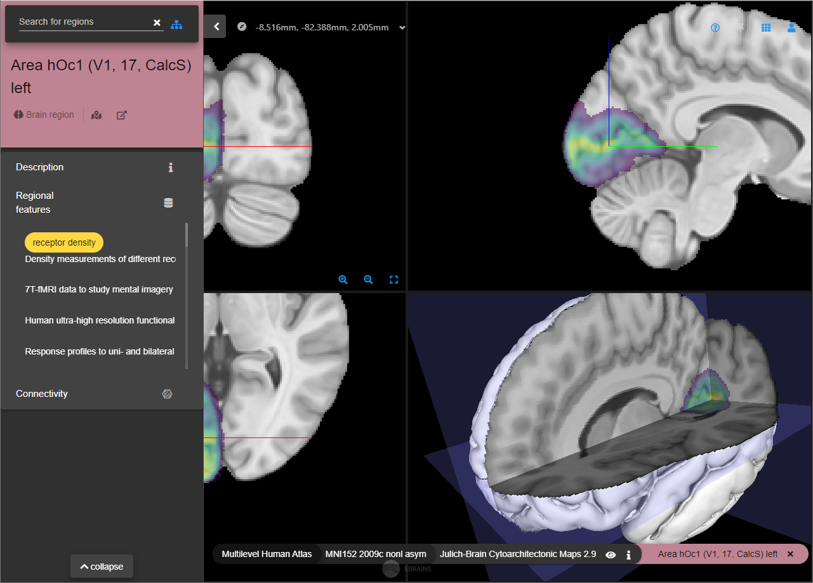

# Step-by-step example

In this tutorial, you will warp an example MRI scan to ICBM MNI152 2009c nonlinear asymmetric space and assign a region to a point in the input space. For this example, we use a NIfTI file from the publicly available [NFBS Skull-Stripped Repository](http://preprocessed-connectomes-project.org/NFB_skullstripped/). We choose the T1-weighted MRI scan `sub-A00028185_ses-NFB3_T1w.nii.gz` of subject `A00028185`.

**TODO** Update screenshot  

1. Download the NFBS skull-stripped images from [here](http://preprocessed-connectomes-project.org/NFB_skullstripped/).
1. Unpack the .tar.gz archive.
1. Choose `path_to_dataset/NFBS_Dataset/A00028185/sub-A00028185_ses-NFB3_T1w.nii.gz` as <mark>Input NIfTI</mark>.  
You can choose this file from the file explorer by clicking <mark>...</mark>.
1. Leave the <mark>Output folder</mark> at the default location `path_to_your_home/voluba-mriwarp`.
1. Click <mark>Warp input to MNI152 space</mark> to warp the brain of the subject to ICBM MNI152 2009c nonlinear asymmetric space. The progress bar indicates that the calculation is still running. When the registration is finished, a green checkmark will appear next to the button.  

**TODO** Add switching to Region assignment tab  

1. Double-click a location in the input space to assign brain regions to it. We select a point in the visual cortex. In the side panel on the left every listed region is indeed part of the visual cortex.

    

1. Click <mark>:fa-external-link:</mark> to get more details about a specific region in siibra-explorer. We choose the most probable brain region for this point, which is Area hOc1 (V1, 17, CalcS) left.

    
