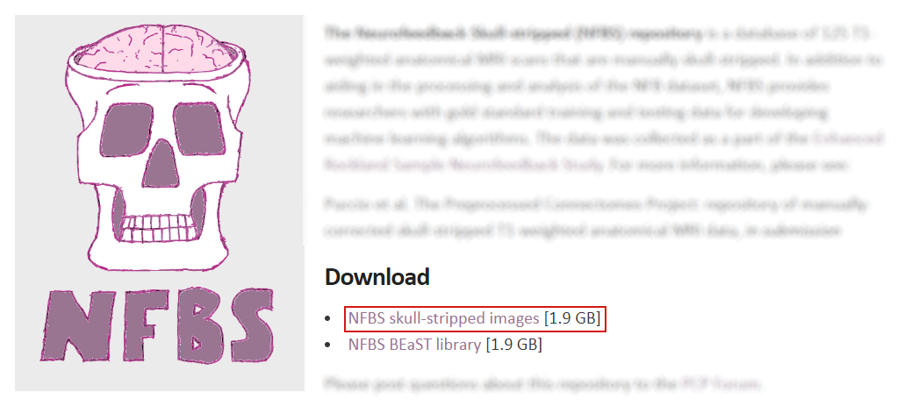
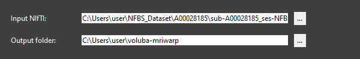
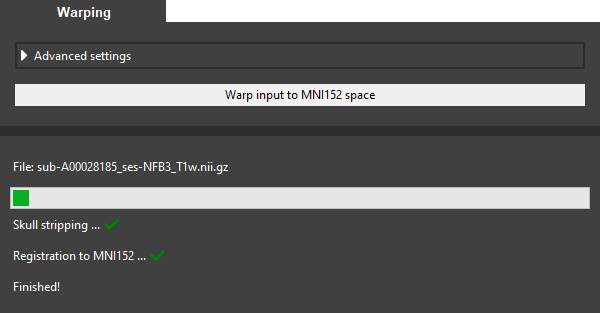
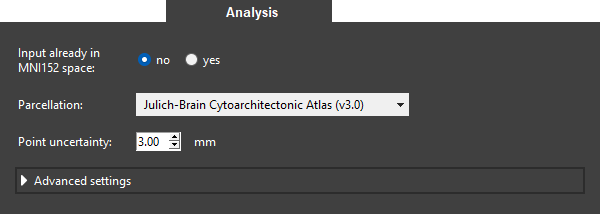
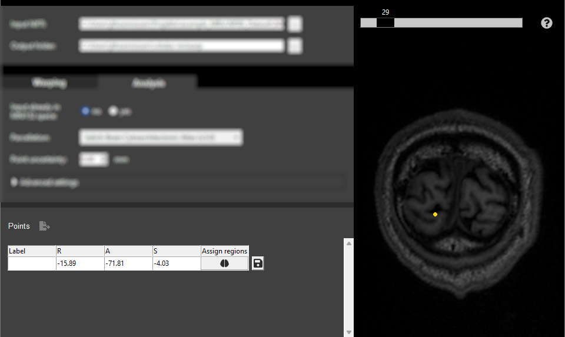
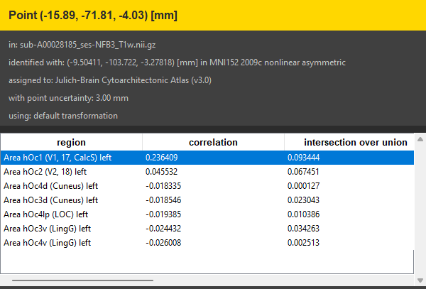
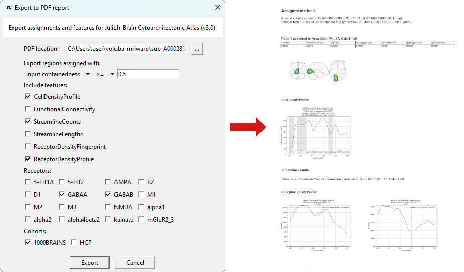

# Step-by-step example

In this tutorial, you will warp an example MRI scan to [MNI ICBM 152 2009c Nonlinear Asymmetric space]((https://www.bic.mni.mcgill.ca/ServicesAtlases/ICBM152NLin2009)) and analyze a point of the input space in the detailed anatomical context of the [EBRAINS Human Brain Atlas]((https://www.ebrains.eu/tools/human-brain-atlas)). 

## Get the example dataset

Let's start the tutorial by downloading an example dataset. We use a sample from the publicly available [NFBS Skull-Stripped Repository](http://preprocessed-connectomes-project.org/NFB_skullstripped/) and choose the T1-weighted MRI scan `sub-A00028185_ses-NFB3_T1w.nii.gz` of subject `A00028185`. This scan contains the subject's whole-brain including the skull. 

* Download the NFBS skull-stripped images from [here](http://preprocessed-connectomes-project.org/NFB_skullstripped/).
* Unpack the .tar.gz archive.

    
  

## Warp the MRI scan to MNI152 space

To be able to perform an analysis in the anatomical context of the atlas we first need to register the input MRI scan to the standardized MNI152 space.

* Launch _voluba-mriwarp_.
* Choose `<path_to_dataset>/NFBS_Dataset/A00028185/sub-A00028185_ses-NFB3_T1w.nii.gz` as <mark>Input NIfTI</mark>.  
You can choose this file from the file explorer by clicking <mark>...</mark>.
* Set the <mark>Output folder</mark> to the directory where you want the warping results to be saved. We keep the default location `<path_to_your_home>/voluba-mriwarp`.
    
    
  

* Click <mark>Warp input to MNI152 space</mark> to warp the brain of the subject to MNI152 space using the default registration method. This method is relatively fast but less accurate than the [advanced version](../warping/#advanced-settings). The progress bar indicates that the calculation is still running. When the registration is finished, a green checkmark will appear next to each step performed.

    

## Analyze a point in the atlas context

After successful warping _voluba-mriwarp_ can now use the resulting transformation to warp points of the input MRI scan to MNI152 space. In this way, it can assign brain regions of the EBRAINS Human Brain Atlas to these points through the siibra toolsuite. 

* Switch to the <mark>Analysis</mark> tab.
* Keep the setting for <mark>Input already in MNI152 space</mark> as the example MRI scan shows the subject in input space and not in MNI152 space.
* Leave the parcellation as is because we want to assign the point to brain regions of the [Julich-Brain Cytoarchitectonic Atlas (v3.0)](https://search.kg.ebrains.eu/instances/7ad727a1-537d-4f80-a69b-ac8b184a823c).
* Set the <mark>Point uncertainty</mark> to 3 mm. The reason for this is that coordinates are typically not exact but have several millimeters of uncertainty (especially after warping).
    
    
  

* Select a point by either clicking a location in the interactive viewer or entering the coordinates into the first row of the <mark>Points</mark> table. We select the point `(15.89, -71.81, -4.03)` in the visual cortex of the left hemisphere. If you would like to use the same point we recommend adding it via the table.
* Click on the brain icon in the table to start the probabilistic region assignment.

    
  

* You should soon see the results of the anatomical assignment at the bottom of the side panel. As we specified a point uncertainty [different measures](../analysis/#results-of-the-analysis) for each assigned region are shown. Indeed, the region that correlates most with the selected point is **Area hOc1 (V1, 17, CalcS) left** which is part of the visual system.
    
    
  

## Use the results

Now that we investigated which brain regions the selected point correlates with, we can perform further analysis based on these regions. Besides getting a quick overview with [siibra-explorer](https://atlases.ebrains.eu/viewer/#/) _voluba-mriwarp_ offers to export the extended analysis to a PDF report.

**Quick overview**  

* Double-click a row in the table to open the according region in a browser window in siibra-explorer. This allows you to get a quick overview of more details about an assigned region and linked multimodal data features. 

    
  

**Detailed report**

* Go back to _voluba_mriwarp_.
* Click on the save button next to the brain icon in the <mark>Points</mark> table to note the selected point for further analysis and PDF export.
* Select  next to <mark>Points</mark> to define the analysis and create the PDF report for all saved points. 
* Keep the <mark>PDF location</mark> as is to save the PDF to the output folder. If you would like to choose a different location, click on <mark>...</mark> to select a folder and filename.
* Set the filter to `input containedness >= 0.5` as, in this tutorial, we are only interested in regions in which the saved point is likely contained. This will only include brain regions to the report that fulfill the requirement for the assignment. Feel free to adjust the filter at your will.
* Choose between different multimodal data features that complement your analysis. Here, we are interested in cell densities, connectivity and receptor densities. For receptor density you need to select specific receptors and for connectivity a cohort is required. For this tutorial, we choose `GABAA` and `GABAB` as well as the `1000BRAINS` study.
* Use the <mark>Export</mark> button to initialize the creation of the PDF report.

    
  

**Congratulations, you finished the tutorial!**