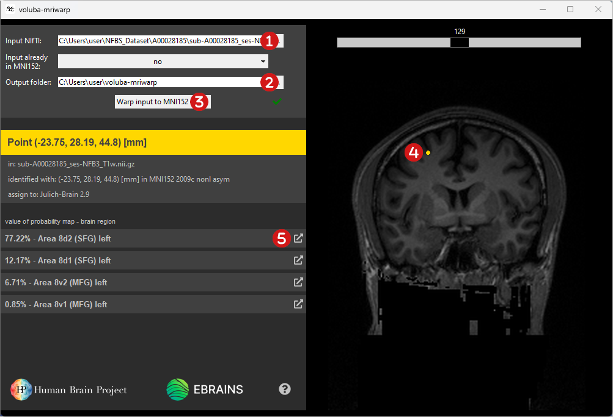
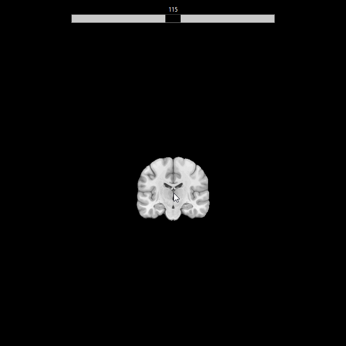

# Usage

_voluba-mriwarp_ consists of two panels. The side panel on the left is for [warping](#warping) the input T1-weighted MRI scan to MNI152 space and displaying the results of the [probabilistic region assignment](#probabilistic-region-assignment). The [viewer](#viewer) on the right side is for displaying and inspecting the input MRI scan.

!!! info
    When running _voluba-mriwarp_ for the first time, the startup may take a few minutes as siibra components need to be fetched.

## Quick start

The general workflow for _voluba-mriwarp_ can be summarized as follows:

 Choose an **input MRI scan**.    
 Choose an **output folder** for the warping results.  
 **Warp** the input MRI to MNI152 space.  
 **Select a point** in the viewer via double-click to assign a region to it.  
 View more details about a specific region in **siibra-explorer**.

## Warping an individual brain to MNI152 space

The goal of warping is to align an image in 3D space. In _voluba-mriwarp_, a nonlinear registration method automatically warps a whole brain MRI scan to ICBM MNI152 2009c Nonlinear Asymmetric space. To perform warping in _voluba-mriwarp_ follow these steps:

 **Select the input MRI scan to register.**  
The <mark>Input NIfTI</mark> has to be in NIfTI format (.nii or .nii.gz) and has to contain the whole brain of the subject. You can either manually type in the path to the file or you can choose the input MRI scan from the file explorer by clicking <mark>...</mark>.

 **Choose an output folder for the warping results.**  
All results generated during warping will be saved to the given <mark>Output folder</mark>, which can also be customized to a different folder. After successful registration you can find the following files there, assuming the input MRI scan is `filename.nii.gz`:

* `filename_stripped.nii.gz`: Individual brain with the skull removed.
* `filename_stripped_mask.nii.gz`: Brain mask covering the individual brain without the skull.
* `filename_registered.nii.gz`: Individual brain with the skull removed registered to ICBM MNI152 2009c nonlinear asymmetric space.
* `filename_transformationComposite.h5`: Transformation matrix encoding the warping from MNI152 to the input space.
* `filename_transformationInverseComposite.h5`: Transformation matrix encoding the warping from the input to MNI152 space.

 **Warp the individual brain to MNI152 space.**  
Click <mark>Warp input to MNI152 space</mark> to start the automatic nonlinear registration. Depending on your computer's memory and the size of the MRI scan, computation time may vary. If the registration was successful, you will see a green check mark next to the button. You can find the results in your selected <mark>Output folder</mark>.

## Assigning regions to points in the input space

_voluba-mriwarp_ allows you to make a probabilistic assignment of a point in the input space to brain regions. Probabilistic assignment means that at the given location values of different probability maps are retrieved from Julich Brain Cytoarchitectonic Maps 2.9. With the resulting list of regions, you get the most probable region assigned to your selected point.

To perform probabilistic region assignment in _voluba-mriwarp_ follow these steps:

 **Select the input MRI scan to inspect.**  
The <mark>Input NIfTI</mark> has to be in NIfTI format (.nii or .nii.gz) and has to contain the whole brain of the subject. You can either manually type in the path to the file or you can choose the input MRI scan in the file explorer by clicking <mark>...</mark>.

 **Choose the output folder containing the warping results.**  
Probabilistic region assignment can only be performed if a transformation from the input to MNI152 space exists. If the chosen input MRI scan is already in MNI152 space, select **yes** for <mark>Input already in MNI152</mark>. In this case, no transformation is applied during region assignment as the individual brain scan itself is already aligned. Otherwise, _voluba-mriwarp_ will search the matching transformation matrix `filename_transformationInverseComposite.h5` in the given <mark>Output folder</mark>. Please change the location to the folder where the warping results for the given <mark>Input NIfTI</mark> were written to. If there are no results to this MRI scan yet, you need to [warp the input](#warping) first.

!!! hint
    The default output directory is `C:\Users\your_username\voluba-mriwarp`.

 **Select a point in the viewer to assign a region to it**.  
Double-click a point in the input scan in the [viewer](#viewer). _voluba-mriwarp_ will then assign regions to this point and display the results in the side panel on the left. The percentage tells you the probability of the cytoarchitectonic area occurring at the selected point.

 **View more details about a specific region in siibra-explorer.**  
Click <mark>:fa-external-link:</mark> to get more information about the brain region in [siibra-explorer](https://atlases.ebrains.eu/viewer/human). Explore brain connectivity and multimodal data features like transmitter receptor densities, cell distributions, and physiological recordings linked to this area.

## Viewing an input brain

Initially, the viewer displays the MNI152 template. In this case, you can select points to retrieve a region without providing a transformation matrix. To load an MRI scan into the viewer, follow this step:

 **Select the input MRI scan to inspect.**  
The <mark>Input NIfTI</mark> has to be in NIfTI format (.nii or .nii.gz) and has to contain the whole brain of the subject. You can either manually type in the path to the file or you can choose the input MRI scan in the file explorer by clicking <mark>...</mark>.

In the viewer, you can move the MRI scan around, zoom in/out and view different slices of the scan. Inspect the volume just like in Google Maps: 

**Move**: Drag and drop the MRI scan.  
**Zoom in/out**: Use your mouse wheel or zoom with two fingers on your touchpad.  
**Change slices**: Use the slider at the top of the viewer to display a different slice.  

