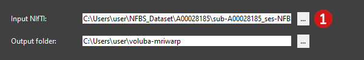

# Viewer usage

Initially, the viewer displays the MNI152 template. To load an MRI scan into the viewer, follow this step:

 **Select the input MRI scan to inspect.**  
The <mark>Input NIfTI</mark> has to be in NIfTI format (.nii or .nii.gz) and has to contain the whole brain of the subject. You can either manually type in the path to the file or you can choose the input MRI scan in the file explorer by clicking <mark>...</mark>.

In the viewer, you can move the MRI scan around, zoom in/out and view different slices of the scan.

**Move**: Drag and drop the MRI scan.  
**Zoom in/out**: Use your mouse wheel or zoom with two fingers on your touchpad.  
**Change slices**: Use the slider at the top of the viewer to display a different slice.  

