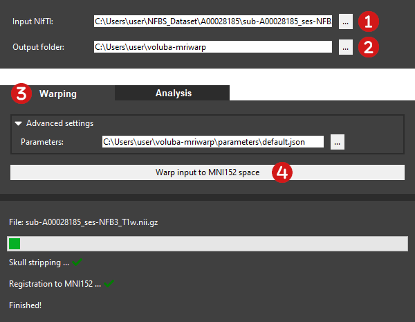

# Registration to MNI152 space

In general, the goal of warping is to align an image in 3D space. In _voluba-mriwarp_ a whole brain structural MRI scan is warped to MNI ICBM 152 2009c Nonlinear Asymmetric space using nonlinear registration methods.

**Why MNI ICBM 152 2009c Nonlinear Asymmetric space?**  
Registration to this standardized space enables anchoring the input scan to the according atlas template in the [EBRAINS Human Brain Atlas](https://www.ebrains.eu/tools/human-brain-atlas). This allows _voluba_mriwarp_ to [analyze](analysis.md) the input scan in the detailed anatomical context of the atlas through the siibra toolsuite.

!!! Info
    For convenience, MNI ICBM 152 2009c Nonlinear Asymmetric space will be called MNI152 space from now on.

To perform warping to MNI152 space in _voluba-mriwarp_ follow these steps:



 **Select the input MRI scan to register.**  
The <mark>Input NIfTI</mark> has to be a whole-brain T1-weighted MRI scan in NIfTI format (.nii or .nii.gz). You can either manually type in the path to the file or you can choose the input MRI scan from the file explorer by clicking <mark>...</mark>.

 **Choose an output folder for the warping results.**  
All results generated during warping will be saved to the given <mark>Output folder</mark>, which can also be customized to a different folder. Let's assume the input MRI scan is `filename.nii.gz`. After successful registration you can find the following files in the folder:

* `filename_stripped.nii.gz`: Input brain with the skull removed
* `filename_stripped_mask.nii.gz`: Brain mask covering the input brain without the skull
* `filename_registered.nii.gz`: Input brain with the skull removed registered to MNI152 space
* `filename_transformationComposite.h5`: Transformation matrix encoding the warping from MNI152 to the input space
* `filename_transformationInverseComposite.h5`: Transformation matrix encoding the warping from the input to MNI152 space

 **Switch to the <mark>Warping</mark> menu section.**

 **Warp the input brain to MNI152 space.**  
Click <mark>Warp input to MNI152 space</mark> to start the automatic nonlinear registration. Depending on your computer's memory, the size of the MRI scan and the selected [registration method](#advanced-settings), computation time may vary. The progress bar indicates that the calculation is still running and is accompanied by a status showing the performed steps. If the registration was successful, you will see a green check mark next to each step. You can find the results in your selected <mark>Output folder</mark>.

## Advanced settings

Besides the default registration, _voluba-mriwarp_ allows you to use an advanced set of parameters for warping the input MRI to MNI152 space. With the advanced warping you can achieve a more accurate registration which takes more time to compute though. The default and advanced registration parameters can be found in `<path_to_your_home>/voluba-mriwarp/parameters`. To use the optimized parameter set select the `optimized.json` for the <mark>Advanced settings</mark>. The output files will then have a leading `nonlinear` in their filename. If you select the predefined default registration, _voluba-mriwarp_ will automatically find the transformation in your output folder. If you choose different registration parameters, you need to specify the location of the transformation file in the <mark>Analysis</mark> tab under <mark>Advanced settings</mark>. Thus, for the optimized parameter set you will need to choose `nonlinear_<filename>_transformationInverseComposite.h5`.

If you are familiar with ANTs you can also specify your own parameters in a JSON file for _voluba-mriwarp_ to use. The default and advanced registration parameters serve as an example on how to format the JSON file so that _voluba-mriwarp_ can process it. In the parameter JSON you can specify multiple antsRegistration commands that are successively executed in the given order. This way you can for example do a linear registration first and use the result as an initial transformation for a nonlinear warping. For each command, you can then specify the [antsRegistration parameters](#antsregistration-options) in the form of key-value `"<antsRegistration option>": "<value>"`. To define different stages, use a list of key-value pairs under `"stages"`.

```json
{
    "command name": {
        "antsRegistration option": "value",
        "stages": [
            {
                "antsRegistration option": "value",
            },
        ]
    },
}
```

To define your own ANTs registration command, you can use the following macros to encode dynamic values. They will be replaced accordingly by _voluba-mriwarp_.

| macro | value |
|-------|-------|
| NAME | filename of input MRI scan specified in <mark>Input NIfTI</mark> without file extension |
| OUTPATH | path to location specified in <mark>Output folder</mark> |
| FIXED | path to MNI152 template |
| MOVING | path to input MRI scan specified in <mark>Input NIfTI</mark> | 
| MASK | path to skull-stripping mask of the input MRI |
| TRANSFORM | OUTPATH/NAME_transformation | 
| VOLUME | OUTPATH/NAME_registered.nii.gz |

For debugging and checking the output of antsRegistration, please take a look at the log file, which is stored in `$TEMP/voluba-mriwarp`.

!!! Hint
    On Windows, $TEMP is usually `<path_to_your_home>/AppData/Local/Temp`.

### antsRegistration options

_voluba-mriwarp_ uses [ANTs Eotapinoma](https://github.com/ANTsX/ANTs/releases/tag/v2.4.4), therefore the following parameters can be used for registration definition:

<pre><code class="text"><b>dimensionality</b> 2/3/4

    This option forces the image to be treated as a specified-dimensional image. If
    not specified, we try to infer the dimensionality from the input image.
</code></pre>

<pre><code class="text"><b>output</b> outputTransformPrefix
       [outputTransformPrefix,&ltoutputWarpedImage&gt,&ltoutputInverseWarpedImage&gt]
    
    Specify the output transform prefix (output format is .nii.gz ). Optionally, one
    can choose to warp the moving image to the fixed space and, if the inverse
    transform exists, one can also output the warped fixed image. Note that only the
    images specified in the first metric call are warped. Use antsApplyTransforms to
    warp other images using the resultant transform(s). When a composite transform
    is not specified, linear transforms are specified with a '.mat' suffix and
    displacement fields with a 'Warp.nii.gz' suffix (and 'InverseWarp.nii.gz', when
    applicable. In addition, for velocity-based transforms, the full velocity field
    is written to file ('VelocityField.nii.gz') as long as the collapse transforms
    flag is turned off ('-z 0').
</code></pre>

<pre><code class="text"><b>save-state</b> saveStateAsTransform

    Specify the output file for the current state of the registration. The state
    file is written to an hdf5 composite file. It is specially useful if we want to
    save the current state of a SyN registration to the disk, so we can load and
    restore that later to continue the next registration process directly started
    from the last saved state. The output file of this flag is the same as the
    write-composite-transform, unless the last transform is a SyN transform. In that
    case, the inverse displacement field of the SyN transform is also added to the
    output composite transform. Again notice that this file cannot be treated as a
    transform, and restore-state option must be used to load the written file by
    this flag.
</code></pre>

<pre><code class="text"><b>restore-state</b> restoreStateAsATransform

    Specify the initial state of the registration which get immediately used to
    directly initialize the registration process. The flag is mutually exclusive
    with other intialization flags.If this flag is used, none of the
    initial-moving-transform and initial-fixed-transform cannot be used.
</code></pre>

<pre><code class="text"><b>write-composite-transform</b> 1/0

    Boolean specifying whether or not the composite transform (and its inverse, if
    it exists) should be written to an hdf5 composite file. This is false by default
    so that only the transform for each stage is written to file.
</code></pre>

<pre><code class="text"><b>print-similarity-measure-interval</b> unsignedIntegerValue

    Prints out the CC similarity metric measure between the full-size input fixed
    and the transformed moving images at each iteration a value of 0 (the default)
    indicates that the full scale computation should not take placeany value greater
    than 0 represents the interval of full scale metric computation.
</code></pre>

<pre><code class="text"><b>write-interval-volumes</b> unsignedIntegerValue

    Writes out the output volume at each iteration. It helps to present the
    registration process as a short movie a value of 0 (the default) indicates that
    this option should not take placeany value greater than 0 represents the
    interval between the iterations which outputs are written to the disk.
</code></pre>

<pre><code class="text"><b>collapse-output-transforms</b> 1/0

    Collapse output transforms. Specifically, enabling this option combines all
    adjacent transforms wherepossible. All adjacent linear transforms are written to
    disk in the forman itk affine transform (called xxxGenericAffine.mat).
    Similarly, all adjacent displacement field transforms are combined when written
    to disk (e.g. xxxWarp.nii.gz and xxxInverseWarp.nii.gz (if available)).Also, an
    output composite transform including the collapsed transforms is written to the
    disk (called outputCollapsed(Inverse)Composite).
</code></pre>

<pre><code class="text"><b>initialize-transforms-per-stage</b> 1/0

    Initialize linear transforms from the previous stage. By enabling this option,
    the current linear stage transform is directly intialized from the previous
    stage`s linear transform; this allows multiple linear stages to be run where
    each stage directly updates the estimated linear transform from the previous
    stage. (e.g. Translation -> Rigid -> Affine).
</code></pre>

<pre><code class="text"><b>interpolation</b> Linear
              NearestNeighbor
              MultiLabel[&ltsigma=imageSpacing&gt,&ltalpha=4.0&gt]
              Gaussian[&ltsigma=imageSpacing&gt,&ltalpha=1.0&gt]
              BSpline[&ltorder=3&gt]
              CosineWindowedSinc
              WelchWindowedSinc
              HammingWindowedSinc
              LanczosWindowedSinc
              GenericLabel[&ltinterpolator=Linear&gt]

    Several interpolation options are available in ITK. These have all been made
    available. Currently the interpolator choice is only used to warp (and possibly
    inverse warp) the final output image(s).
</code></pre>

<pre><code class="text"><b>restrict-deformation</b> PxQxR

    This option allows the user to restrict the optimization of the displacement
    field, translation, rigid or affine transform on a per-component basis. For
    example, if one wants to limit the deformation or rotation of 3-D volume to the
    first two dimensions, this is possible by specifying a weight vector of '1x1x0'
    for a deformation field or '1x1x0x1x1x0' for a rigid transformation.
    Low-dimensional restriction only works if there are no preceding
    transformations.All stages up to and including the desired stage must have this
    option specified,even if they should not be restricted (in which case specify
    1x1x1...)
</code></pre>

<pre><code class="text"><b>initial-fixed-transform</b> initialTransform
                        [initialTransform,&ltuseInverse&gt]
                        [fixedImage,movingImage,initializationFeature]

    Specify the initial fixed transform(s) which get immediately incorporated into
    the composite transform. The order of the transforms is stack-esque in that the
    last transform specified on the command line is the first to be applied. In
    addition to initialization with ITK transforms, the user can perform an initial
    translation alignment by specifying the fixed and moving images and selecting an
    initialization feature. These features include using the geometric center of the
    images (=0), the image intensities (=1), or the origin of the images (=2).
</code></pre>

<pre><code class="text"><b>initial-moving-transform</b> initialTransform
                         [initialTransform,&ltuseInverse&gt]
                         [fixedImage,movingImage,initializationFeature]

    Specify the initial moving transform(s) which get immediately incorporated into
    the composite transform. The order of the transforms is stack-esque in that the
    last transform specified on the command line is the first to be applied. In
    addition to initialization with ITK transforms, the user can perform an initial
    translation alignment by specifying the fixed and moving images and selecting an
    initialization feature. These features include using the geometric center of the
    images (=0), the image intensities (=1), or the origin of the images (=2).
</code></pre>

<pre><code class="text"><b>metric</b> CC[fixedImage,movingImage,metricWeight,radius,&ltsamplingStrategy={None,Regular,Random}&gt,&ltsamplingPercentage=[0,1]&gt,&ltuseGradientFilter=false&gt]
       MI[fixedImage,movingImage,metricWeight,numberOfBins,&ltsamplingStrategy={None,Regular,Random}&gt,&ltsamplingPercentage=[0,1]&gt,&ltuseGradientFilter=false&gt]
       Mattes[fixedImage,movingImage,metricWeight,numberOfBins,&ltsamplingStrategy={None,Regular,Random}&gt,&ltsamplingPercentage=[0,1]&gt,&ltuseGradientFilter=false&gt]
       MeanSquares[fixedImage,movingImage,metricWeight,radius=NA,&ltsamplingStrategy={None,Regular,Random}&gt,&ltsamplingPercentage=[0,1]&gt,&ltuseGradientFilter=false&gt]
       Demons[fixedImage,movingImage,metricWeight,radius=NA,&ltsamplingStrategy={None,Regular,Random}&gt,&ltsamplingPercentage=[0,1]&gt,&ltuseGradientFilter=false&gt]
       GC[fixedImage,movingImage,metricWeight,radius=NA,&ltsamplingStrategy={None,Regular,Random}&gt,&ltsamplingPercentage=[0,1]&gt,&ltuseGradientFilter=false&gt]
       ICP[fixedPointSet,movingPointSet,metricWeight,&ltsamplingPercentage=[0,1]&gt,&ltboundaryPointsOnly=0&gt]
       PSE[fixedPointSet,movingPointSet,metricWeight,&ltsamplingPercentage=[0,1]&gt,&ltboundaryPointsOnly=0&gt,&ltpointSetSigma=1&gt,&ltkNeighborhood=50&gt]
       JHCT[fixedPointSet,movingPointSet,metricWeight,&ltsamplingPercentage=[0,1]&gt,&ltboundaryPointsOnly=0&gt,&ltpointSetSigma=1&gt,&ltkNeighborhood=50&gt,&ltalpha=1.1&gt,&ltuseAnisotropicCovariances=1&gt]  
       IGDM[fixedImage,movingImage,metricWeight,fixedMask,movingMask,&ltneighborhoodRadius=0x0&gt,&ltintensitySigma=0&gt,&ltdistanceSigma=0&gt,&ltkNeighborhood=1&gt,&ltgradientSigma=1&gt]
    
    These image metrics are available--- CC: ANTS neighborhood cross correlation,
    MI: Mutual information, Demons: (Thirion), MeanSquares, and GC: Global
    Correlation. The "metricWeight" variable is used to modulate the per stage
    weighting of the metrics. The metrics can also employ a sampling strategy
    defined by a sampling percentage. The sampling strategy defaults to 'None' (aka
    a dense sampling of one sample per voxel), otherwise it defines a point set over
    which to optimize the metric. The point set can be on a regular lattice or a
    random lattice of points slightly perturbed to minimize aliasing artifacts.
    samplingPercentage defines the fraction of points to select from the domain.
    useGradientFilter specifies whether a smoothingfilter is applied when estimating
    the metric gradient.In addition, three point set metrics are available:
    Euclidean (ICP), Point-set expectation (PSE), and Jensen-Havrda-Charvet-Tsallis
    (JHCT).
</code></pre>

<pre><code class="text"><b>transform</b> Rigid[gradientStep]
          Affine[gradientStep]
          CompositeAffine[gradientStep]
          Similarity[gradientStep]
          Translation[gradientStep]
          BSpline[gradientStep,meshSizeAtBaseLevel]
          GaussianDisplacementField[gradientStep,updateFieldVarianceInVoxelSpace,totalFieldVarianceInVoxelSpace]
          BSplineDisplacementField[gradientStep,updateFieldMeshSizeAtBaseLevel,&lttotalFieldMeshSizeAtBaseLevel=0&gt,&ltsplineOrder=3&gt]
          TimeVaryingVelocityField[gradientStep,numberOfTimeIndices,updateFieldVarianceInVoxelSpace,updateFieldTimeVariance,totalFieldVarianceInVoxelSpace,totalFieldTimeVariance]       
          TimeVaryingBSplineVelocityField[gradientStep,velocityFieldMeshSize,&ltnumberOfTimePointSamples=4&gt,&ltsplineOrder=3&gt]
          SyN[gradientStep,&ltupdateFieldVarianceInVoxelSpace=3&gt,&lttotalFieldVarianceInVoxelSpace=0&gt]
          BSplineSyN[gradientStep,updateFieldMeshSizeAtBaseLevel,&lttotalFieldMeshSizeAtBaseLevel=0&gt,&ltsplineOrder=3&gt]
          Exponential[gradientStep,updateFieldVarianceInVoxelSpace,velocityFieldVarianceInVoxelSpace,&ltnumberOfIntegrationSteps&gt]
          BSplineExponential[gradientStep,updateFieldMeshSizeAtBaseLevel,&ltvelocityFieldMeshSizeAtBaseLevel=0&gt,&ltnumberOfIntegrationSteps&gt,&ltsplineOrder=3&gt]
    
    Several transform options are available. The gradientStep or learningRate
    characterizes the gradient descent optimization and is scaled appropriately for
    each transform using the shift scales estimator. Subsequent parameters are
    transform-specific and can be determined from the usage. For the B-spline
    transforms one can also specify the smoothing in terms of spline distance (i.e.
    knot spacing).
</code></pre>

<pre><code class="text"><b>convergence</b> MxNxO
            [MxNxO,&ltconvergenceThreshold=1e-6&gt,&ltconvergenceWindowSize=10&gt]

    Convergence is determined from the number of iterations per level and is
    determined by fitting a line to the normalized energy profile of the last N
    iterations (where N is specified by the window size) and determining the slope
    which is then compared with the convergence threshold.
</code></pre>

<pre><code class="text"><b>smoothing-sigmas</b> MxNxO...

    Specify the sigma of gaussian smoothing at each level. Units are given in terms
    of voxels ('vox') or physical spacing ('mm'). Example usage is '4x2x1mm' and
    '4x2x1vox' where no units implies voxel spacing.
</code></pre>

<pre><code class="text"><b>shrink-factors</b> MxNxO...

    Specify the shrink factor for the virtual domain (typically the fixed image) at
    each level.
</code></pre>

<pre><code class="text"><b>use-histogram-matching</b> 0/1

    Histogram match the images before registration. Default is false.
</code></pre>

<pre><code class="text"><b>winsorize-image-intensities</b> [lowerQuantile,upperQuantile]

    Winsorize data based on specified quantiles.
</code></pre>

<pre><code class="text"><b>masks</b> [fixedImageMask,movingImageMask]

    Image masks to limit voxels considered by the metric. Two options are allowed
    for mask specification: 1) Either the user specifies a single mask to be used
    for all stages or 2) the user specifies a mask for each stage. With the latter
    one can select to which stages masks are applied by supplying valid file names.
    If the file does not exist, a mask will not be used for that stage. Note that we
    handle the fixed and moving masks separately to enforce this constraint.
</code></pre>

<pre><code class="text"><b>float</b> 0/1

    Use 'float' instead of 'double' for computations. Default is false.
</code></pre>

<pre><code class="text"><b>minc</b> 0/1

    Use MINC file formats for transformations. Default is false.
</code></pre>

<pre><code class="text"><b>random-seed</b> seedValue

    Use a fixed seed for random number generation. By default, the system clock is
    used to initialize the seeding. The fixed seed can be any nonzero int value.
</code></pre>

<pre><code class="text"><b>verbose</b> 0/1

    Verbose output. Default is false.
</code></pre>