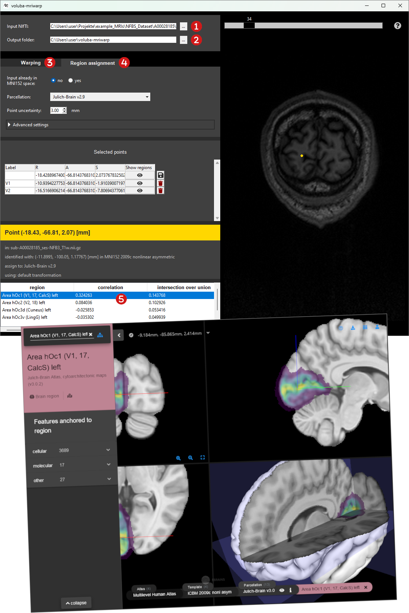

# General workflow

_voluba-mriwarp_ consists of two panels. The side panel on the left is for [warping](warping.md) the input T1-weighted MRI scan to [MNI ICBM 152 2009c Nonlinear Asymmetric space](https://www.bic.mni.mcgill.ca/ServicesAtlases/ICBM152NLin2009) and displaying the results of the [analysis in the atlas context](analysis.md). The [viewer](viewer.md) on the right side is for displaying and inspecting the input MRI scan.

!!! info
    When running _voluba-mriwarp_ for the first time, the startup may take a few minutes as siibra components need to be fetched.

The general workflow for _voluba-mriwarp_ can be summarized as follows:

 Choose an **input MRI scan**.  
 Choose an **output folder** for the warping results.  
 **Warp** the input MRI to MNI152 space.  
 **Click or enter a coordinate** to perform an analysis in the atlas context based on region assignment.  
 Get a **quick overview** about an assigned brain region in [siibra-explorer](https://atlases.ebrains.eu/viewer/go/human).  
 **Export** assigned brain regions together with linked data features to a PDF report for extended analysis.

